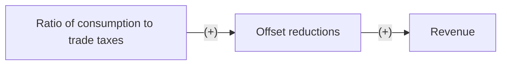

1. Michael, Michael S., Panos Hatzipanayotou, and Stephen M. Miller. "Integrated reforms of tariffs and consumption taxes." Journal of Public Economics 52.3 (1993): 417-428. 
https://www.sciencedirect.com/science/article/pii/004727279390044T
 - Professor Ly suggested it.
 - **The big question(s) of the paper**:
 - 1. Will reducing tariffs  within an integrated tax structure enhance welfare in less-developed countries while maintaining government revenue?
 - 2. Will increasing consumption taxes within an integrated tax structure enhance welfare in less-developed countries while maintaining government revenue?
 - **Specific research question**: Given high tariffs, low consumption taxes, and the well-known relative inefficienticies of tariffs to consumption taxes, can we identify conditions under which the reduction of tariffs and increase in consumption taxes improve welfare while kepping government revenue constant?
 - **Theories**: When tariffs are reduced and consumption taxes increase, governments pay less foreign taxes and more domestic taxes, increasing welfare by driving up demand for substitute products. 
 - **Research Hypothesis**: When tariffs are reduced and consumption taxes increase, welfare increases when government revenue remains constant. 


2. Hansen, John Mark. “Taxation and the Political Economy of the Tariff.” International Organization 44.4 (1990): 527–551.

https://www.cambridge.org/core/journals/international-organization/article/taxation-and-the-political-economy-of-the-tariff/862A74C3F04C078C3C4FEF3C556606FF

-  **How I found this paper**: provided by Professor Ly
-  **Big picture question**: To research the implications of a connection that is widely acknowledged and rarely appreciated by exploring the nexus of tariffs and taxes.
- **Specific research question**: Exploring how tariffs were instruments of advantage because they were the outcome of private benefits pursued to collective detriment.
- **Conceptual Framework**: Firstly, develop a theory of taxation politics and apply it to the tariff. Then, submit the theory to an empirical test. Finally, from the extent of the treasury's dependence upon it and from the distributive pattern of its burdens and benefits, the article can make its conclusion.
- **Research Hypothesis**: "Government Revenue dependence and distributive incidence account for several diverse aspects of American tariff policy, including the structure of its coalitions, the shifts in its objectives, and the timing of its innovations."
- **Theories**: "Analysts grounded in the traditions of American politics credited tariff outcomes to domestic political pressures. On the other half, analysts attributed tariff policy to pursuits of national interest in an anarchic world economy."


3. Waglé, Swarnim. "Coordinating tax reforms in the poorest countries: Can lost tariffs be recouped?." World Bank Policy Research Working Paper 5919 (2011).

https://papers.ssrn.com/sol3/papers.cfm?abstract_id=1974850

-  **How I found this paper**: provided by Professor Ly
-  **Big picture question**: How do low-income countries pivot from trade taxes to domestic consumption taxes? 
- **Specific research question**: How effective are transitions from trade taxes to domestic consumption taxes for low-income countries when its come to revenue?
- **Conceptual Framework**: Used actual data on imported value, tariffs, and up to ten domestic taxes on more than 400,000 import transactions from Nepal to develop scenarios in which tariffs can be cut with the least impact on total revenue. Also used partial equilibrium models to produce estimates that assuage fears about the scale of loss of revenue and production.
- **Research Hypothesis**: If low-income countries properly enforce domestic consumption taxes, then they will better offset reductions in comparison to their use of trade taxes because they will see a positive change in estimated revenue. 
- **Theories**: When low-income countries have higher domestic consumption taxes in relation to trades taxes, they will minimize loss of revenue, since they are reducing expenses by paying less foreign taxes.  





4. Ho, Thuy Tien, Xuan Hang Tran, and Quang Khai Nguyen. "Tax revenue-economic growth relationship and the role of trade openness in developing countries." Cogent Business & Management 10(2) (2023)

https://www.tandfonline.com/doi/full/10.1080/23311975.2023.2213959

-  **How I found this paper**: provided by Professor Ly
-  **Big picture question**: How does tax revenue impact economic growth?
- **Specific research question**: Do developing countries with accelerating economic growth benefit from increased tax revenue in the context of increasing trade openness?
- **Conceptual Framework**: Used data from 29 developing countries experiencing accelerating economic growth from 2000-2020. Additionally, applied the Fixed Effect Model (FEM) and the Generalized Least Squares (GLS) estimation methods for panel data to test the proposed hypotheses.
- **Research Hypothesis**: If trade openness in developing countries increases moderately, then tax revenue will positively affect general ecnomic growth because these developing countries will can regulate the macroeconomy and mobilize revenue.
- **Theories**: When developing countries with accelerating economic growth have higher tax revenue, they will have increases economic growth which can be increased by a moderate increase in trade openness.


5. M. Shahe Emran, Joseph E. Stiglitz, "On selective indirect tax reform in developing countries" Journal of Public Economics 599-623 (2005)

https://www.sciencedirect.com/science/article/pii/S0047272704000933

-  **How I found this paper**: Google Scholar
-  **Big picture question**: How do tax policy reforms in developing countries influence overall economic welfare, particulary when accounting for the role of the informal economy?
- **Specific research question**: How does the presence of an informal economy impact the effectiveness of indirect tax reforms--specifically the reduction of trade taxes and the increase of VAT--on welfare in developing countries?
- **Conceptual Framework/Theories**: Emphasizing the importance of considering the informal economy in tax policy analysis to avoid detrimental effects on welfare.

  - reducing trade taxes while increasing VAT will enhance revenue in developing countries
  - highlighting existing theoretical models' limitations when applied to real-world scenarios with informal economic activity
- **Research Hypothesis**: The current approach of reducing trade tariffs while increasing VAT in developing countries may lead to a reduction in overall welfare, specifically when considering the informal economy and its impact on VAT coverage.

 ```mermaid
flowchart LR
  A[(Trade_Tariffs)] --(-)---> B(welfare)
  B --(-)--> C{informal economy in developing countries}
  K(Value Added Tax) --(+)--> B
```
